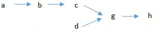
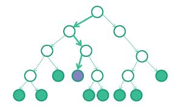
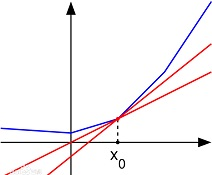

##  启发式算法求解混合整数线性优化问题 （mixed integer linear optimization） 

## —— 生产计划安排和资源分配

### 问题描述和范围限定：

生产计划安排分为两种：静态和动态计划。

静态计划生成的时间距离实际生产时间较长，以假设所有预设条件都满足为前提，在给定优化目标下（比如最小延迟，最低库存金额，etc.）寻找最优计划。静态计划一般采用优化算法实现。

动态计划基于静态计划，是在实际排产出现异常时（比如原材料供应不足，设备突然故障造成停线，上游产品突发质量问题，产线工人罢工，etc.）

这篇文章主要关注生成静态计划的优化算法，包括启发式算法和确切算法。更多动态计划的算法有机会再介绍。

这篇文章的优化算法适用于此类计划问题 1). 任务有截止日期，2). 资源为有限资源并且不可持续（比如设备利用率，不可持续性表现在剩余资源有实效且不可存储，过期无效），3).多资源多任务排产，4）任务目标为以最小库存成本在截止日期前完成生产。

各个任务间可以有层级关系，下游任务可以由多个上游任务合并形成，但是每个上游任务只能对应唯一的下游任务（树形产品结构，成品在根节点，原材料在叶节点，半成品在其他中间节点）。

以测试数据的产品结构为例：a和d为原材料，b,c,g为半成品，h为成品。其中g为assembly。在测试数据中，每个任务有唯一编码。



### 使用的算法：

**Branch and Bound**：常用的解决混合整数问题（MIP）的确切算法

确切算法（exact）指能保证找到最优解的一类算法（相对于启发式算法heuristic），在解决问题时往往由于需要搜索庞大的解空间而造成运算量过大运算时间过长。仍然有一些确切算法适合用于求解某一类特定问题，在问题规模可控的条件下能在可接受的时间内给出最优解。

Branch and Bound是一类经常用于求解MIP的确切算法，通过构造树形解空间并以边界形式对解空间剪枝达到有效搜索最优解的目的。在我们的生产日程安排问题中，branch and bound 以非最优有效解作为上边界，松弛问题的最优解（无效解）作为下边界，通过分枝和节点选择规则，将边界解不断分解为子问题分别求解，直到找到最优解。由于存在上下边界，大部分中间节点会因为超过已存在的有效解范围而被剪枝，从而快速缩小解空间，提高算法效率。


[图片来源](http://www.gurobi.com/resources/getting-started/mip-basics)

Branch and bound算法的核心是如何得到每个节点上的上下边界。常用的方法是Lagrangian relaxation.

**Lagrangian Relaxation**：常用的线性优化问题降低求解难度的技术

一些由实际场景建模得到的线性优化问题由于存在大量约束条件，使精确求解此类方程组难度增大。Lagrangian relaxation是一类即能保留目标函数线性特点，又能将较难限制条件转化为目标函数一部分的常用松弛方法。此类松弛方程的解可以无限接近于原始方程组的解，因此常常作为原始解的限制边界，应用于组合优化算法中。

比如在我们的生产日程安排问题中，将使用Lagrangian relaxation方法得到节点的下边界，并在此基础上使用启发式算法（Lagrangian heuristic），得到有效的然而可能非最优的解作为节点上边界。

简单来说，假设原始问题为 

P: minimize $ c^Tx $

subject to:  

$ Ax \geq b $ (假设为难约束)，$ Bx \leq d $ （假设为简单约束），$ x \in \mathbb{Z}_{+}^n $

可以转化为求解松弛问题

PL: minimize $ c^Tx + \lambda^T(b - Ax) $

s.t. $ Bx \leq d $，$ x \in \mathbb{Z}_{+}^n $

其中 $ \lambda $是Lagrangian multiplier（拉格朗日乘数）。对于Lagrangian multiplier的取值，一般采用subgradient方法迭代求解。

**Subgradient**：不可导函数的梯度法求极值

[梯度法](https://baike.baidu.com/item/%E6%A2%AF%E5%BA%A6%E4%B8%8B%E9%99%8D/4864937?fr=aladdin)是常用的求解方程的方法。在给定目标下，首先随机选取一组方程的初始（无效）解，根据计算目标值和实际目标值的差异判断下一次迭代中尝试的解应该向哪个方向调整。梯度可以标识调整方向，是通过对损失函数求一阶导得到的。

然而在优化问题中，由于有限制条件的存在，损失函数往往不可导。所以不能采用梯度法，而是使用很相似的次梯度法标识每次迭代解的调整方向。



### 案例：工厂生产计划安排

**测试数据**：

假设产品结构如下：


a, d为独立原材料，b,c,g为生产过程中的半成品，h为成品。

作为测试数据，假设需要生产4件相同产品，唯一编号分别为任务名+1-4，产品结构以“上游任务”和“下游任务”两个字段连接，其中“下游任务”只可能有一个产品编号；“上游任务”可以有多个编号，代表装配任务。执行任务的设备分别为mk11-16，上游设备编号不能小于下游设备编号（启发式算法将从最下游设备开始排产）。其他如运行时间，库存成本，订单截止日期 etc.如下表所示：

任务|设备|上游任务|下游任务|运行时长|成品编号|截止日期|单位时间库存成本
----|----|----|----|----|----|----|----
a1|mk16||b1|3|h1|50|1
b1|mk15|a1|c1|2|h1|50|2
c1|mk14|b1|g1|5|h1|50|4
d1|mk13||g1|4|h1|50|1
g1|mk12|c1, d1|h1|6|h1|50|8
h1|mk11|g1||1|h1|50|10
a2|mk16||b2|3|h2|60|1
b2|mk15|a2|c2|2|h2|60|2
c2|mk14|b2|g2|5|h2|60|4
d2|mk13||g2|4|h2|60|1
g2|mk12|c2, d2|h2|6|h2|60|8
h2|mk11|g2||1|h2|60|10
a3|mk16||b3|3|h3|65|1
b3|mk15|a3|c3|2|h3|65|2
c3|mk14|b3|g3|5|h3|65|4
d3|mk13||g3|4|h3|65|1
g3|mk12|c3, d3|h3|6|h3|65|8
h3|mk11|g3||1|h3|65|10
a4|mk16||b4|3|h4|70|1
b4|mk15|a4|c4|2|h4|70|2
c4|mk14|b4|g4|5|h4|70|4
d4|mk13||g4|4|h4|70|1
g4|mk12|c4, d4|h4|6|h4|70|8
h4|mk11|g4||1|h4|70|10

**建模构造原始问题**：

i: 当前任务编号

k: 当前设备编号

$\phi(i)$: 当前任务的紧邻下游任务集（immediate successors）

$\varphi(i)$: 当前任务对应的最终成品编号

$\Lambda(i)$: 当前任务的紧邻上游任务集（immediate predecessors）

Mk: 将在当前设备上排产的任务集

F: 成品集

$ p_i $: 任务 i 的运行时长

$ d_i $: 任务 i 的成品截止时间

$ h_i $: 任务 i 的每件每单位时间库存成本

L: 一个足够大的正值

求解任务sequence和开始时间：

$ s_i $: 任务 i 的开始时间

$ y_{ij} $: 0/1，如果为1则代表 i 在 j 前发生

原始日程安排问题为：

$ (\mathrm{P}): \text{minimize } z = \sum_{i \notin F} h_i(s_{\phi(i)} - s_i) + \sum_{i \in F} h_i(d_i - s_i)  $

s.t.

$ s_i + p_i - s_j \leq  L \cdot (1 - y_{ij}) \text{  for } i, j \in M_k(i < j) \text{ and } \forall k $,  (2)

$ s_j + p_j - s_i \leq L \cdot y_{ij} \text{  for } i, j \in M_k(i < j) \text{ and } \forall k $,  (3)

$ s_i + p_i \leq d_i, \text{for } i \in F $, (4)

$ s_i + p_i \leq s_{\phi(i)}, \text{for } i \notin F $, (5)

$ s_i \geq 0, \forall i $, (6)

$ y_{ij} = {0,1} \text{ for } i,j \notin M_k(i < j) \text{ and } \forall k $. (7)

通过定义阶梯库存成本echelon inventory，可以进一步简化原始问题 (P) 为：

$ (\mathrm{P}): \text{minimize } z = \sum_{i} e_i(d_{\varphi(i)} - s_i)$,  (8)

其中：

$ e_i \equiv h_i - \sum_{j \in \Lambda(i)} h_j, \forall i $, 

$ d_{\varphi(i)} $ 是 i 对应成品的截止时间。

建模和算法实现基于[这篇论文](https://pdfs.semanticscholar.org/1f93/f3da32b66134b5bc040692c76ca2a888680c.pdf)。

**将原始问题转化为松弛问题**，并拆解为独立的单设备多任务排产松弛问题，分别求解：

通过松弛(4), (5)两项限制，可以得到新的松弛问题：

$ (\mathrm{LR}_\lambda): \text{ minimize } \sum_{\forall i} \big( \lambda_i - e_i - \sum_{j \in \Lambda(i)} \lambda_j \big) s_i + \sum_{\forall i} \big( e_i d_{\varphi(i)} + \lambda_i p_i \big) - \sum_{i \in F} \lambda_i d_i$ （9）

s.t. (2), (3), (6), (7), 并且$ \lambda_i \geq 0 \forall i $.

用 $ L(\lambda) $表示松弛问题 $ (\mathrm{LR}_\lambda) $的最优解，即原始问题$ (\mathrm{P}) $ 的下边界。

任意给定一组 $\lambda_n $（拉格朗日乘数），都可以用来求解公式(9)而得出一个最优解 $ L(\lambda_n) $。所以松弛问题 $ (\mathrm{LR}_\lambda) $ 转化为求解 $ (\mathrm{LR}_\lambda) $ 的[双对问题](https://en.wikipedia.org/wiki/Duality_(optimization)) ：

$ (\mathrm{PL}): \text{ maximize } L(\lambda_n) $ s.t. $ \lambda \geq 0 $。

继续把松弛问题  $ (\mathrm{LR}_\lambda) $ 的双对问题 $ (\mathrm{PL}) $ 分解，可以得到K个独立的单设备多任务排产问题

$ (\mathrm{DP}_k): \text{ minimize } \sum_{i \in M_k} \big( \lambda_i - e_i - \sum_{j \in \Lambda(i)} \lambda_j \big) s_i $ (10)

s.t.

$ s_i + p_i - s_j \leq L \cdot (1 - y_{ij}, \forall i, j \in M_k(i < j)$, (2')

$ s_j + p_j - s_i \leq L \cdot y_{ij}, \forall i, j \in M_k(i < j) $, (3')

$ y_{ij} = {0,1}, \forall i, j \in M_k(i < j) $, (7')

$ \lambda_i \geq 0, \forall i \in M_k $ (11)

$ s_i \geq l_k, \forall i \in M_k $, (12)

$ s_i + p_i \leq u_k, \forall i \in M_k $. (13)

由于在给定 $ \lambda $的情况下，松弛问题$ (\mathrm{LR}_\lambda) $的第二项和第三项为常数，所以在新的独立问题$ (\mathrm{DP}_k) $中省略了这两项，而只用 $ L_k(\lambda) $表示 $ (\mathrm{DP}_k) $ 的解值，并且有：

$ L(\lambda) = \sum_{k=1}^{K} L_k(\lambda) + \sum_i(e_i d_{\varphi(i)} + \lambda_i p_i) - \sum_{i \in F} \lambda_i d_i $. 

为了得到**单设备多任务排产的近似解**，使用了"通用加权最短时长优先"排序法（GWSPT）。

“加权”指 $ (\mathrm{DP}_k) $ 中的权重项: 

$ w_i =  \big( \lambda_i - e_i - \sum_{j \in \Lambda(i)} \lambda_j \big) $

[可以证明](https://pdfs.semanticscholar.org/1f93/f3da32b66134b5bc040692c76ca2a888680c.pdf)，当排序顺序按照 w / p 降序排列时，排序顺序为最优，即：

$ y_{ij} = 1 \text{ and } y_{ji} = 0 \text{ if } \cfrac{w_i}{p_i} \geq \cfrac{w_j}{p_j} $

根据$ w_i $的符号，可以将k设备的任务集 $ M_k $ 分为三个数据子集：

$ M_k^{+} = {i: w_i > 0 \text{ and } i \in M_k}$

$ M_k^{0} = {i: w_i = 0 \text{ and } i \in M_k}$

$ M_k^{-} = {i: w_i < 0 \text{ and } i \in M_k}$

[可以进一步证明](https://pdfs.semanticscholar.org/1f93/f3da32b66134b5bc040692c76ca2a888680c.pdf)，如果

$ M_k^{+}$ 子集的任务排序在 $\big[ l_k, l_k + \sum_{i \in M_k^{+}} p_i \big]$ 区间，

$ M_k^{0}$ 子集的任务排序在 $\big[  l_k + \sum_{i \in M_k^{+}} p_i,  u_k - \sum_{i \in M_k^{-}} p_i \big] $ 区间，

$ M_k^{-}$ 子集的任务排序在 $\big[ u_k - \sum_{i \in M_k^{-}} p_i, u_k \big]$ 区间，

并分别按照GWSPT排序法排序，则$ (\mathrm{DP}_k) $可以得到最优近似解；

其中，对于每个设备的排产时间上下界$ l_k, u_k$的计算如下：

$ u_k = max_{i \in M_k}\big{\{}d_{\varphi(i)} - \sum_{j \in \Phi(i)} p_j\big{\}} $, 其中 $ \Phi(i) $ 集合包含任务 i 和所有任务 i 的下游任务。

$ l_k = min_{i \in M_k} \big{\{}min_{j \in \Psi(i)}\big(\sum_{l \in \Theta(i,j)} p_l - p_i \big)\big{\}} $ 其中 $ \Psi(i) $ 是所有任务 i 的上游任务中的原材料集合，$ \Theta(i,j) $是从原材料到任务 i 的路径上的所有其他任务集合。

"通用加权最短时长优先"排序法（GWSPT）代码实现 (本文中的代码示例仅供参考。由于与实际代码的结构不同，可能有参数定义的偏差。另外比较长的函数由于篇幅原因没有展示，有需要的请私聊)：

```python
def doGWSPT(df, lk, uk, plusTotal, minusTotal):
    """ generalized weighted shortest processing time (GWSPT) sequence 
        based on weight/processTime. proposition 1 + corollary 1.       
    """
    mkGroup = df['mkGroup'].tolist()[0]
    df = df.sort_values(by='wOverp', ascending=False)
    sIdx = df.columns.tolist().index('startTime')
    pIdx = df.columns.tolist().index('processTime')
    if mkGroup == 'plus':
        startPoint = lk
    elif mkGroup == 'zero':
        startPoint = lk + plusTotal
    else:
        startPoint = uk - minusTotal
        
    df.iloc[0, sIdx] = startPoint
    p = df.iloc[0, pIdx]
    for i in np.arange(df.shape[0] - 1):
        df.iloc[i+1, sIdx] = startPoint + p
        p += df.iloc[i+1, pIdx]
    return df
```

计算权重 $  \sum_{j \in \Lambda(i)} \lambda_j $的代码实现：

```python
def calculateSigmaLambda_lambdaj(waitingList, row):
    """ calculate sum of lambda j for all j in Lambda_i, 
        Lambda_i is the set of i's immediate predecessors in 
        the product hierarchy.
        input:
            waitingList: the list of items to be scheduled, 
            with the following data fields:
                immSuc: immediate successor of the item. 
                    if none then 'final product'.
                lambdaIter: lagrangian multiplier from the previous iteration
                startTime: current best solution for a start time
                s_phi: start time of the item's immediate successor
                dueDate: due date of the item's final product
                equipment: resource to be scheduled
    """
    immPre = row['immPre']
    if immPre == 'rawMaterial':
        return 0
    if not isinstance(immPre, list):
        immPre = [immPre]
    lambdaTotal = 0
    for pre in immPre:
        lambdaTotal += waitingList.loc[waitingList.parts == pre, 
                                                               'lambdaIter'].tolist()[0]
    return lambdaTotal
```

计算单设备排产上下边界 $ u_k, l_k $的代码实现：

计算 $ \sum_{l \in \Theta(i,j)} p_l - p_i $:

```python
def findPhi(waitingList, product, stack=[]):
    """ recursively find the sum of process time of all j in set Phi(i).
        set Phi(i) contains ALL successors of item i in the 
        product hierarchy (regardless of the equipment where
        they are produced), including i itself.
        
        stack: storage of process times of all items in Phi(i). This
            is used in method calculateSigmaThetaPl() to populate 
            sigmaThetaTbl, as utility table to calculate lb in 
            method findMinPsiPj().
    """
    row = waitingList.loc[waitingList.parts == product, :]
    immSuc = row['immSuc'].tolist()[0]
    processTime = row['processTime'].tolist()[0]
    finalProd = row['finalProduct'].tolist()[0]
    stack.append((product, processTime))
    if product != finalProd:
        findPhi(immSuc, stack)
    return stack

def findSigmaPhiPj(stack):
    Phi_pj = [x[1] for x in stack]
    sigmaPhi_pj = np.sum(Phi_pj)
    return sigmaPhi_pj

def calculateSigmaThetaPl(waitingList):
    """ populates sigmaThetaTbl with tuples 
        (i, j, sum-of-processTime-of-l)
        for all j in set Psi(i) and l in set Theta(i, j):
        set Psi(i) contains ALL predecessors of item i which do not have
        any predecessor(raw material). Theta(i, j) is the set of 
        all items on the path connecting items i and j in 
        the product structure (including both i and j). however the sum
        of processTime should exclude pi.
    """
    tmp = waitingList.apply(lambda row:
                            findSigmaPhiPj(row['parts']), axis=1)
    tmp.columns = ['sigmaPhi_pj', 'stack']
    waitingList = pd.concat(
            [waitingList.reset_index(drop=True), tmp], axis=1)
    tmpList = waitingList.loc[
                            waitingList.immPre=='rawMaterial',
                            'stack'].tolist()
            
    for i in np.arange(len(tmpList)):
        tmp = tmpList[i]
        rm = tmp[0][0]  # raw material index
        sigmaP = 0  # cumulative process time of all tasks between i and j
        for j in np.arange(len(tmp) - 1):
            sigmaP += tmp[j][1]
            tmpTheta = pd.DataFrame([[tmp[j+1][0], rm, sigmaP]])
            tmpTheta.columns = ['i', 'j', 'sigmaThetaPl']
            sigmaThetaTbl = pd.concat([sigmaThetaTbl, tmpTheta], 
                                           axis=0)
    return sigmaThetaTbl
```
    
    计算 $ min_{j \in \Psi(i)}\big(\sum_{l \in \Theta(i,j)} p_l - p_i \big)$ :
```python 
    def findMinPsiPj(product, sigmaThetaTbl):
    """ recursively find the min of process time of all j in set Psi(i).
        set Psi(i) contains ALL predecessors of item i that do not have
        any predecessor(raw material). Theta(i, j) is the set of 
        all items on the path connecting items i and j in 
        the product structure.
    """
    Psi_i = sigmaThetaTbl[sigmaThetaTbl['i'] == product]
    if Psi_i.shape[0] == 0:  # rawMaterial node without further predecessor
        return 0
    else:
        # looser lower bound constraints makes solution to (DPk) less 
        # likely to be a feasible solution to the original problem (P); 
        # however it's quicker in overall solution procedure. 
        # therefore taking the min. - shortest path before i as lower 
        # bound instead of the max. - longest path before i.
        return np.min(Psi_i['sigmaThetaPl'])
```
**计算次梯度**：

给定任务 i 对应的拉格朗日乘数的初始值 $ \lambda_i^0 $, 第n次迭代的结果如下：

$ \lambda_i^{n+1} = 
      \begin{cases} 
      max\{0, \lambda_i^n + t_n(s_i^n + p_i - d_i)\} & \quad \forall i \in F, \\
      max\{0, \lambda_i^n + t_n(s_i^n + P_i - s_{\phi(i)}^n)\} & \quad \forall i \notin F,
      \end{cases} 
  $
  
  其中 $ (s_1^n, s_2^n, \dots s_l^n) $ 是松弛问题 $ (\mathrm{LR}_\lambda) $在给定数组 $ \lambda^n $下的一组最优解，
  
  步长 $ t_n = \cfrac{\mu_n(z^{*} - L(\lambda^n))}{\sum_{i \in F}(s_i^n + p_i - d+i)^2 + \sum_{i \notin F}(s_i^n + p_i - s_{\phi(i)}^n)^2} $,
  
  $ \mu_n $是一个范围在(0, 2]的标量，当接近最优解时减小$ \mu_n $保证收敛速度，
  
  $ z^{*} $是 (PL)问题的一个上边界（有效解），迭代计算得出；$L(\lambda^n)$ 是迭代计算的下边界。
  
  另外设定 $ \omega $为最大迭代次数；$ \epsilon $为迭代停止条件：当 $ (z^{*} - L(\lambda^n) / L(\lambda^n) < \epsilon$时停止迭代；$ \zeta $为控制 $ \mu $值变小的参数：当最优解在 $ \zeta $次迭代中没有进步，则减小 $ \mu $值。典型设置为 e.g. $ \omega = 1000, \zeta = 10, \epsilon = 0.001 $。   

计算次梯度的代码实现：
```python
def updateSubgradient(waitingList, zStar, L_lambda):
    """ find best lambda value iteratively.
        input:
            zStar: upper bound on the optimal solution value.
            L(lambda): solution value to LR(lambda) given lambda.
        output:
            updated lambda value stored in waitingList as lambdaIter.
    """
    tn = calculateTn(zStar, L_lambda)
    f = waitingList[waitingList['immSuc']=='finalProduct']
    nf = waitingList[waitingList['immSuc']!='finalProduct']
    
    f['lambdaIter'] = f['lambdaIter'] + tn * (f['startTime'] 
                        + f['processTime'] - f['dueDate'])
    nf['lambdaIter'] = nf['lambdaIter'] + tn * (nf['startTime']
                        + nf['processTime'] - nf['s_phi'])   
    f['lambdaIter'] = np.where(f['lambdaIter'] < 0, 0, f['lambdaIter'])
    nf['lambdaIter'] = np.where(nf['lambdaIter'] < 0, 0, nf['lambdaIter'])
    
    waitingList = pd.concat([f, nf], axis=0)
    return waitingList

def calculateTn(waitingList, zStar, L, mu, ):
    """ learning rate in the subgradient method. """
    numerator = mu * (zStar - L)
    f = waitingList[waitingList.immSuc == 'finalProduct']
    f = np.power(f.startTime + f.processTime - f.dueDate, 2)
    nf = waitingList[waitingList.immSuc != 'finalProduct']
    nf = np.power(nf.startTime + nf.processTime - nf.s_phi, 2)
    
    tn = numerator / (np.sum(f) + np.sum(nf))
    return tn
```
**求解上边界** $z^{*}$ ：

<u>拉格朗日启发式算法伪代码</u>：
- 在设备 k 上给定$ M_k $集的初始排产顺序 $\rho_k$
- 根据同一设备的任务集$ M_k $的下边界解，调整各任务的开始时间如下：

    - 设所有在 k 设备上，且任务开始时间晚于 i 的任务集为 $ \Gamma(i) = \{j: y_{ij} = 1\}, \forall i \in M_k$,
    - 重设任务 i 的截止时间为 $d_i = s_{\phi(i)}, \forall i \in M_k \text{\F} $ 
    - 重设任务 i 的开始时间为 $s_i = min \{d_i, min_{j \in \Gamma(i)} s_j \} - p_i, \forall i \in M_k$
- 从M_k的最晚任务 l 开始，遍历M_k集合的所有任务 i ：
    - 如果任务 i 的截止时间 $ d_i > d_l + p_i $：把任务 i 排到M_k的最后一位（最晚开始）
        - 否则：从 l 开始，逐一检查排在 l 和 i 中间的任务 h，如果有 $ s_h - (s_{h-1} + p_{h-1}) \geq p_i $ 并且 $ (s_{h-1} + p_{h-1}) + p_i \leq d_i $，则把任务 i 插在h 和 h-1之间。

迭代更新 $s_{\phi(i)}$ 代码实现：
```python
def updateSphi(waitingList, _tbl):
    """ s_phi(i) is the start time of phi(i).
        phi(i): immediate successor of part i. 
        Be ware - this method will change the table index. 
    """
    tbl = _tbl.copy()
    try: 
        tbl.drop('s_phi', axis=1, inplace=True)
    except ValueError: 
        pass
    s = waitingList.loc[:, ['parts', 'startTime']]
    s.columns = ['immSuc', 's_phi']
    tbl = tbl.merge(s, how='left', on='immSuc')
    tbl.loc[tbl['s_phi'].isnull(), 's_phi'] = (
       tbl.loc[tbl['s_phi'].isnull(), 'dueDate'])
    return tbl
```    
迭代计算$ min_{j \in \Gamma(i)} s_j  $的代码实现：
```python
def calculateMinGammaSj(_mkTbl, sortedAsc=False):
    """ calculates minimum start time among tasks j, which 
        belong to set Gamma(i), as basis to the calcultion of start times
        si = min(s_(phi_i), min_(j in Gamma(i)) sj) - pi
        input:
            _mkTbl: table of parts to be sequenced on the same 
                equipment mk
            sortedAsc: if the parts are already sorted in ascending 
                order by start time. If False, then sort. If True, 
                then keep the original to save time.
    """
    if sortedAsc is False:
        mkTbl = _mkTbl.sort_values(by='startTime', ascending=True)
    else:
        mkTbl = _mkTbl.copy()
    sj = mkTbl['startTime'].tolist()
    sj.pop(0)
    sj.append(99999)
    mkTbl['minGammaSj'] = sj
    return mkTbl
```

**实现branch and bound**：

<u>节点选择伪代码</u>：

- 给定当前节点的设备 mk
- 给定当前节点的随机任务 row
- 给定已确定的下游排产计划 set S
- 给定仍未排产的上游任务集 set P'
- 给定判断上边界 UB

createNode:
 - 将row添加到set S，假设作为已确定任务排产
 - 将row从set P'中删除
 - 将set P'作为Lagrangian heuristic的输入，由启发式算法迭代得到新解的上下边界
    
<u>分枝伪代码</u>：

- 给定初始有效解（来自Lagrangian heuristic）z\*
- 给定初始上边界UB
- 给定包含全部设备的数组machineList，按升序排列

branchOut:
 - 将z\*中最下游设备上开始时间最晚的任务作为根节点添加到空集set S
 - 将根节点对应的任务从set P'中删除
 - 设当前节点设备mk为machinList的第一个元素
 - 迭代，直到迭代结果的上边界不再进步，或达到最大迭代次数：
     - 设当前设备mk上所有未排产的任务为数据集 s_k
     - 如果s_k的长度为1：
         - 直接定义s_k中的任务生产日期
         - 将s_k中的任务添加到set S中
         - 将s_k中的任务从set P'中删除
         - 清空s_k
     - 如果s_k的长度为0：
         - 设mk为machineList中的下一个元素
     - 否则：
         - 将s_k中的每个任务分别作为输入
         - 执行createNode，返回所有新解，及其上下界
         - 如果没有找到有效解，或新解的下边界大于已存在的有效解的上边界，则删除节点，不再分枝
         - 否则：
           - 如果新解的上边界小于（优于）已存在的有效解，则用新解替换作为新的最优有效解
           - 更新上边界
     - 选择所有保留的新节点中下边界最小的节点的set S和set P'，代替对应的旧数据集
     - 进入下一轮迭代
  
  ### 测试案例结果：

KPI | lagrangian relaxation|lagrangian relaxation and heuristic|lagrangian relaxation and heuristic and BB
-----|-------------------------------|--------------------------------------------- --|-------------------------------
inventory holding cost|520|500|460
average throughput|22.5|21.75|20.25
average machine utilization rate|50%|50%|54%

使用分枝限界法可以得到比单纯解松弛问题，或使用启发式算法更好的优化结果。而基于松弛问题和启发式算法的结果，可以使分枝限界法的计算效率大幅度提高。
